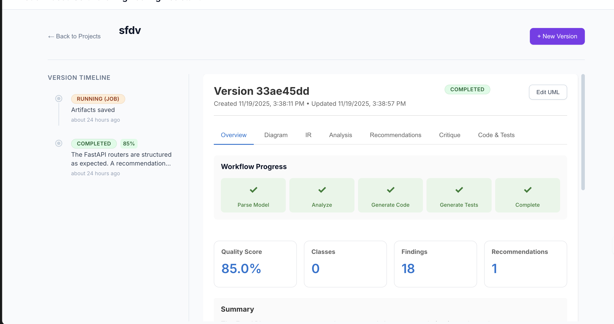

Model-Based Software Engineering Assistant (MBSE Assistant)
=========================================================

A compact multi-agent system that converts UML/PlantUML diagrams into refactored code, tests, and analysis reports. The workflow is designed for clarity and easy extension.

Overview
--------
- Parse UML (PlantUML) into an intermediate representation (IR)
- Analyze for SOLID/design-pattern issues (deterministic detectors + LLM/RAG)
- Generate refactored Python code (services, repositories, interfaces)
- Generate pytest tests and run them in a sandbox with self-correction for syntax/import errors
- Produce `analysis_report` with `findings`, `recommendations`, `patterns_detected`, and `strengths`

Quick start
# Screenshot


---

-----------

Prerequisites: Python 3.12+, Node.js (for UI)

Install:

```bash
git clone https://github.com/yourusername/model-based-se-assistant.git
cd model-based-se-assistant
python -m venv ag
source ag/bin/activate
pip install -r requirements.txt
cp .env.example .env
```

Run backend + UI (development):

```bash
# Backend
source ag/bin/activate
uvicorn backend.api:app --reload --port 8000

# Frontend (dev)
cd ui
npm install
npm run dev
# Browse http://localhost:5173
```

Build UI for production: `cd ui && npm run build` and serve `ui/dist` from a static host or backend.

Key features
------------
- Deterministic detectors: god classes, coupling, long parameter lists
- LLM-enhanced RAG: context-aware recommendations
- Patterns detected: Repository, Service, Controller/Router, Strategy, Factory, Facade, Adapter, Observer
- Strengths: highlights good practices (naming, DI, separation of concerns)
- Self-correction loop for syntax/import errors during test runs

Configuration
-------------
Edit `backend/config.py` or `.env`:

```text
PROJECTS_DIR=./projects
LLM_PROVIDER=gemini
LLM_FALLBACK_MODEL=gpt-4o-mini
SANDBOX_TIMEOUT=60
```

Testing
-------
Unit tests: `pytest -m "not integration"`
Integration tests (LLM keys required): `pytest -m integration`

Development notes
-----------------
- Avoid `uvicorn --reload` watching the repository while generated artifacts are written; set `PROJECTS_DIR` outside the repo to avoid unintended reloads.
- The UI can render `analysis_report.patterns_detected` and `analysis_report.strengths` for quick insight into what is already good.

Contributing
------------
Fork, add tests, open a PR, describe the change and scope (analysis, codegen, tests, UI).

License
-------
MIT
Model-Based Software Engineering Assistant

This repository provides a multi-agent system that turns UML/PlantUML diagrams into refactored code, tests, and architectural guidance.

Overview
--------

This project uses a LangGraph workflow with multiple agents to:

- parse UML (PlantUML) into an intermediate representation (IR)
- analyze the model for SOLID and design-pattern-based issues
- generate refactored code (Python) with interfaces and dependency injection
- generate tests (pytest) and run them in a sandbox
- attempt to self-correct syntax/import errors
- produce a critique report that includes issues, recommendations, and detected patterns

Key components
--------------

- backend: FastAPI server and multi-agent orchestration
- codegen: code generation and refactoring agent
- testgen: automated test generation agent
- parser: PlantUML to JSON IR converter
- analysis: deterministic detectors + LLM-RAG for context-aware suggestions

Quick start
-----------

Prerequisites
- Python 3.12+
- Node.js for the UI
- Optional: Google Gemini/OpenAI keys for LLMs

Install

```bash
git clone https://github.com/yourusername/model-based-se-assistant.git
cd model-based-se-assistant
python -m venv ag
source ag/bin/activate
pip install -r requirements.txt
cp .env.example .env
# Edit .env to add LLM keys if you have them
```

Run backend + UI
-----------------

```bash
# Terminal 1 - Backend
source ag/bin/activate
uvicorn backend.api:app --reload --port 8000

# Terminal 2 - Frontend (dev)
cd ui
npm install
npm run dev

# Open http://localhost:5173
```

Build & serve UI in production
-------------------------------

```bash
cd ui
npm run build
# optionally copy ui/dist/ to backend/static/ and configure the backend to serve static files
```

Features
--------

- Analysis:
  - SOLID violation detection (SRP, OCP, DIP, ISP, LSP)
  - Coupling/cohesion measures
  - Deterministic detectors + LLM-enhanced recommendations
  - `patterns_detected`: heuristics and LLM output (Repository, Service, Router/Controller, Strategy, Factory, Facade, Adapter, Observer)
  - `strengths`: things done well in the model (clear naming, repository usage, DI)

- Code generation:
  - Splits god classes, extracts interfaces
  - Produces multi-file Python project skeleton with services and repositories

- Test generation and execution:
  - Generates pytest suites and attempts to run them in a sandbox with timeout
  - If tests fail due to syntax/import errors, a self-correction loop tries to fix errors (up to a retry limit)

Configuration
-------------

Edit `backend/config.py` or `.env`:

```python
PROJECTS_DIR=./projects
LLM_PROVIDER=gemini
LLM_FALLBACK_MODEL=gpt-4o-mini
SANDBOX_TIMEOUT=60
```

Development notes
-----------------

- Avoid storing generated artifacts in the repo while the dev server runs (set `PROJECTS_DIR` to an external folder to avoid auto-reloads).
- The `analysis_report` includes `patterns_detected` and `strengths` which you can render in the UI to show "what's good" along with problems.

Tests
-----

```bash
# Backend unit tests
pytest -m "not integration"

# Integration tests (LLM keys needed)
pytest -m integration
```

Roadmap / TODOs
---------------

- Frontend: full dashboard, interactive UML editor, WebSocket progress
- RAG: ingest PDFs and docs, multi-modal RAG
- Multi-language codegen: TypeScript, Java
- DevOps: docker-compose, helm charts
- Security: user auth, sandbox hardening

Contributing
------------

Please fork, add tests, and open a PR.

License
-------

MIT
# Model-Based Software Engineering Assistant 🤖

A production-ready AI-powered system that transforms UML/PlantUML diagrams into fully refactored, tested, and documented code using multi-agent orchestration with LangGraph.

[](https://www.python.org/downloads/)
[](LICENSE)

## 🎯 Overview

This system implements a complete **Model-Based Software Engineering (MBSE)** workflow that:

1. **Parses** UML/PlantUML models into intermediate representation
2. **Analyzes** designs using SOLID principles, design patterns, and RAG-enhanced knowledge base
3. **Generates** refactored, production-ready code with proper abstractions
4. **Creates** comprehensive test suites with analysis-aware test generation
5. **Executes** tests in sandboxed environments
6. **Critiques** and suggests improvements
7. **Saves** all artifacts persistently with full project memory
8. **Visualizes** the entire process through a React-based dashboard (in progress)

## 🏗️ Architecture

```
👤 User
    │
    ▼
🤖 Model-Based SE Orchestrator Agent (LangGraph)
    ├── 🗂️ Model Parser Agent → 🧰 uml_to_json_tool
    ├── 🔍 Model Analysis Agent → 📚 design_rule_RAG + 📐 pattern_checker + 🧠 project_memory
    ├── 🏗️ Code Generation Agent → 🧰 code_writer_tool + 🧰 test_generator_tool
    ├── 🧪 Test & Verification Agent → 🧰 code_executor_tool + 🧰 unit_test_runner_tool
    └── 🧑‍🏫 Critic & Refactoring Agent → 📄 improvement_suggestions_tool
    │
    ▼
📦 Final Output: Code + Tests + Analysis + Reports
```

## ✨ Key Features

### 🔍 **Advanced Design Analysis**
- **SOLID Principles**: Detects violations of SRP, OCP, LSP, ISP, DIP
- **Design Patterns**: Identifies missing abstractions and suggests patterns
- **Code Metrics**: LCOM (cohesion), fan-in/fan-out (coupling), cyclomatic complexity
- **RAG-Enhanced**: Retrieves relevant design knowledge from vector database (FAISS/Chroma)
  
Added info: patterns_detected and strengths
- **Pattern Detection**: The analysis identifies existing design patterns implemented in the model (Repository, Service, Router/Controller, Strategy, Factory, Facade, Adapter, Observer) and surfaces them in the analysis output as `patterns_detected`.
- **Strengths / Good Practices**: The analysis also highlights what is already good in your model (e.g., clear service/repository separation, use of stereotypes that indicate framework usage, moderate coupling). These are included as `strengths` in the analysis report.

### 🏗️ **Intelligent Code Generation**
- **Refactoring-Aware**: Automatically splits god classes and extracts interfaces
- **Dependency Injection**: Implements proper DI patterns
- **Analysis-Driven**: Uses analysis findings to guide refactoring decisions
- **Multi-File Output**: Generates organized project structure

### 🧪 **Comprehensive Testing**
- **Analysis-Aware Tests**: Generates tests for cohesion, coupling, DI patterns
- **Multiple Test Types**: Unit, integration, dependency injection, cohesion tests
- **Sandbox Execution**: Safe isolated test execution with timeout protection
- **Coverage Analysis**: Tracks test coverage and quality

### 🛡️ **Production Ready**
- **LLM Fallback**: Automatic fallback from Gemini to GPT-4o-mini
- **Retry Logic**: Exponential backoff with configurable retries
- **Error Handling**: Comprehensive error tracking and recovery
- **Persistent Storage**: All artifacts saved with project memory

## 🚀 Quick Start

### Prerequisites

- Python 3.12+
- OpenAI API key (for fallback)
- Google Gemini API key (optional, primary LLM)

### Installation

```bash
# Clone the repository
git clone https://github.com/yourusername/model-based-se-assistant.git
cd model-based-se-assistant

# Create virtual environment
python -m venv venv
source venv/bin/activate  # On Windows: venv\Scripts\activate

# Install dependencies
pip install -r requirements.txt

# Set up environment variables
cp .env.example .env
# Edit .env and add your API keys:
# OPENAI_API_KEY=your_key_here
# GOOGLE_API_KEY=your_key_here (optional)
```

### Usage

```python
from backend.graph import get_compiled_graph

# Define your UML model
plantuml_model = """
@startuml
class OrderManager {
  +database: Database
  +emailService: EmailService
  +createOrder(userId, items): Order
  +calculateTotal(order): float
  +sendConfirmationEmail(order)
}
class Database {
  +save(data)
}
class EmailService {
  +send(to, subject, body)
}
OrderManager --> Database
OrderManager --> EmailService
@enduml
"""

# Create workflow graph
graph = get_compiled_graph()

# Execute workflow
result = graph.invoke({
    "project_id": "my-project",
    "model_text": plantuml_model,
    "model_format": "plantuml",
    "description": "Order management system"
})

# Access generated artifacts
print(f"Generated {len(result['generated_code']['files'])} files")
print(f"Found {len(result['analysis_report']['findings'])} issues")
print(f"Created {result['generated_tests']['total_tests']} tests")
```

### Running the backend safely during workflow execution

By default, `uvicorn --reload` watches the entire repository which includes `projects/` and will restart the server any time artifacts are written into that directory (e.g., generated source/tests). If you're running long-running workflows that write into `projects/`, use these options:

- Development (safe reload that only watches backend code):

```bash
./scripts/run-dev-server.sh
```

- Production / Persistent server (no reload):

```bash
./scripts/run-prod-server.sh
```

Alternatively set `PROJECTS_DIR` in `.env` to a location outside the repository (e.g., `~/mbse-projects`) so artifact writes won't trigger reloads:

```
PROJECTS_DIR=/Users/yourname/mbse-projects

### UI (Frontend) Startup

Use the React + Vite UI in `ui/` during development. Steps:

1. Install Node dependencies

```bash
cd ui
npm install
```

2. Start the UI dev server (default port: 5173)

```bash
npm run dev
```

3. Start the backend in a separate terminal (default port: 8000):

```bash
source ag/bin/activate
uvicorn backend.api:app --reload --port 8000
```

4. Open: http://localhost:5173

Tip: The UI dev server is configured to proxy API requests to the backend. See `ui/vite.config.ts` for configuration.

### Build & Serve the UI (Production)

To build the UI for production and serve it from the backend:

```bash
cd ui
npm run build

# Optionally copy ui/dist content into the backend static folder
# e.g. cp -r ui/dist backend/static

# Serve static files via FastAPI or a static file host (S3, Netlify, Vercel)
```

### Run backend + UI locally (helper)

Open two terminals and run the backend in one and the UI in the other:

```bash
# Terminal 1: backend
source ag/bin/activate
uvicorn backend.api:app --reload --port 8000

# Terminal 2: frontend
cd ui
npm run dev
```

To run both with Docker or docker-compose, add a `docker-compose.yml` that builds both services and sets `VITE_API_BASE_URL` to the backend host.
```

### Output Structure

```
projects/my-project/
├── analysis_report.json    # Design analysis
├── memory.json              # Project memory
├── interfaces.py            # Extracted interfaces
├── models.py                # Data models
├── repositories/            # Repository pattern
├── services/                # Service layer
└── tests/                   # All test files
    ├── __init__.py
    ├── test_interfaces.py
    ├── test_models.py
    └── test_services.py
```

## 📊 Workflow Steps

1. **Parse** (`node_parse_model`) - Converts PlantUML to JSON IR
2. **Analyze** (`node_analyze_model`) - Detects design issues with RAG
3. **Generate Code** (`node_generate_code`) - Creates refactored code
4. **Generate Tests** (`node_generate_tests`) - Creates analysis-aware tests
5. **Save Artifacts** (`node_save_artifacts`) - Persists files to disk
6. **Execute Tests** (`node_run_tests`) - Runs pytest in sandbox
7. **Critique** (`node_critique`) - Reviews and suggests improvements
8. **Final Report** (`node_final_report`) - Assembles comprehensive report

## 🧪 Running Tests

```bash
# Run all unit tests (excludes integration tests that require LLM)
pytest -m "not integration"

# Run integration tests (requires API keys)
pytest -m integration

# Run with coverage
pytest --cov=backend --cov-report=html

# Run full workflow test
python scripts/test_full_workflow.py
```

## 🔧 Configuration

Edit `backend/config.py` or use environment variables:

```python
# LLM Configuration
LLM_PROVIDER = "gemini"              # Primary LLM: "gemini" or "openai"
LLM_FALLBACK_MODEL = "gpt-4o-mini"   # Fallback model
LLM_MAX_TOKENS = 8192                # Max output tokens
LLM_MAX_RETRIES = 3                  # Retry attempts

# RAG Configuration
RAG_BACKEND = "faiss"                # Vector DB: "faiss" or "chroma"
EMBEDDING_PROVIDER = "google"        # Embeddings: "google" or "ollama"

# Project Settings
PROJECTS_DIR = "./projects"          # Output directory
SANDBOX_TIMEOUT = 60                 # Test timeout (seconds)
```

## 📚 Documentation

- [Architecture Overview](backend/README.md)
- [Agent Specifications](backend/agents.py)
- [Graph Workflow](backend/graph.py)
- [Knowledge Base](data/knowledge_base/)
- [Test Suite](tests/)

## 🎯 Use Cases

- **Model-Driven Development**: Transform UML to code automatically
- **Legacy Code Refactoring**: Analyze and refactor existing designs
- **Design Review**: Automated SOLID/pattern analysis
- **Test Generation**: Create comprehensive test suites from models
- **Documentation**: Generate analysis reports and improvement plans

## 🔍 Example Results

From a God Class with 6 methods and multiple responsibilities:

**Before:**
```python
class OrderManager:
    def createOrder(...)
    def calculateTotal(...)
    def sendEmail(...)
    def saveToDatabase(...)
    def generateInvoice(...)
    def logActivity(...)
```

**After (7 refactored files):**
- `interfaces.py` - IRepository, IEmailService, ILogger
- `models.py` - Order, OrderItem data classes
- `repositories/` - Database abstractions
- `services/` - OrderService, EmailService, LogService
- `tests/` - 12+ comprehensive tests

## 🗺️ Roadmap

### 🚀 Upcoming Features (TODOs)

- [ ] **Frontend Integration**
  - [ ] Complete React-based dashboard for visualizing workflows
  - [ ] Interactive UML editor integration
  - [ ] Real-time progress tracking via WebSockets
  - [ ] Artifact browser and code viewer

- [ ] **Enhanced RAG & Knowledge Base**
  - [ ] Support for custom knowledge base ingestion (PDFs, Docs)
  - [ ] Multi-modal RAG (diagram image analysis)
  - [ ] GraphRAG implementation for deeper dependency understanding

- [ ] **Language Support**
  - [ ] Add TypeScript/Node.js code generation support
  - [ ] Add Java/Spring Boot code generation support
  - [ ] Language-agnostic IR (Intermediate Representation) improvements

- [ ] **DevOps & Deployment**
  - [ ] Docker Compose setup for full stack (Frontend + Backend + Vector DB)
  - [ ] Kubernetes Helm charts
  - [ ] CI/CD pipeline templates (GitHub Actions)

- [ ] **Security & Auth**
  - [ ] User authentication and project isolation
  - [ ] API key management and usage quotas
  - [ ] Secure sandbox environment hardening (gVisor/Firecracker)

## 🤝 Contributing

Contributions welcome! Please:

1. Fork the repository
2. Create a feature branch
3. Add tests for new functionality
4. Submit a pull request

## 📄 License

MIT License - see [LICENSE](LICENSE) file

## 🙏 Acknowledgments

- Built with [LangChain](https://github.com/langchain-ai/langchain) and [LangGraph](https://github.com/langchain-ai/langgraph)
- Uses [FAISS](https://github.com/facebookresearch/faiss) for vector similarity
- Inspired by SOLID principles and design patterns literature

## 📧 Contact

For questions or support, please open an issue on GitHub.

---

**⭐ Star this repo if you find it useful!**

## ⬆️ Git operations (push your changes)

After updating docs or code, run these commands to push your changes to GitHub from your active branch:

```bash
git add -A
git commit -m "docs: add UI startup steps and push guide"
git push origin main
```

If you use feature branches and PRs:

```bash
git checkout -b feature/ui-readme
git add -A
git commit -m "feat(ui): add README UI instructions"
git push -u origin feature/ui-readme
# Open a PR on GitHub
```
